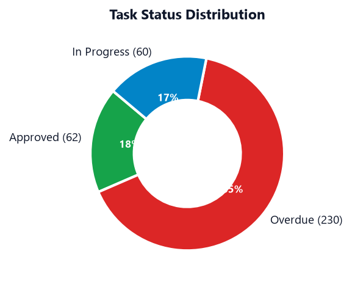
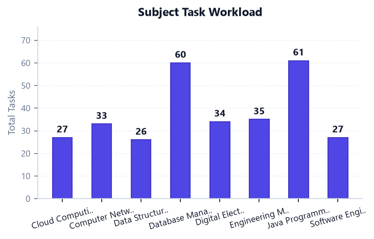
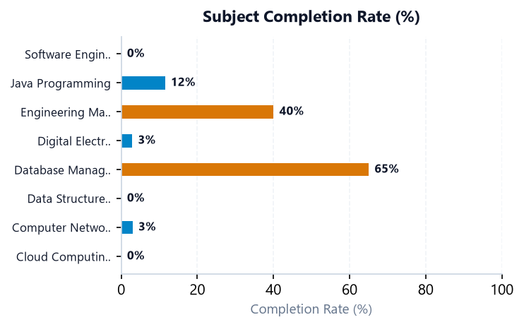
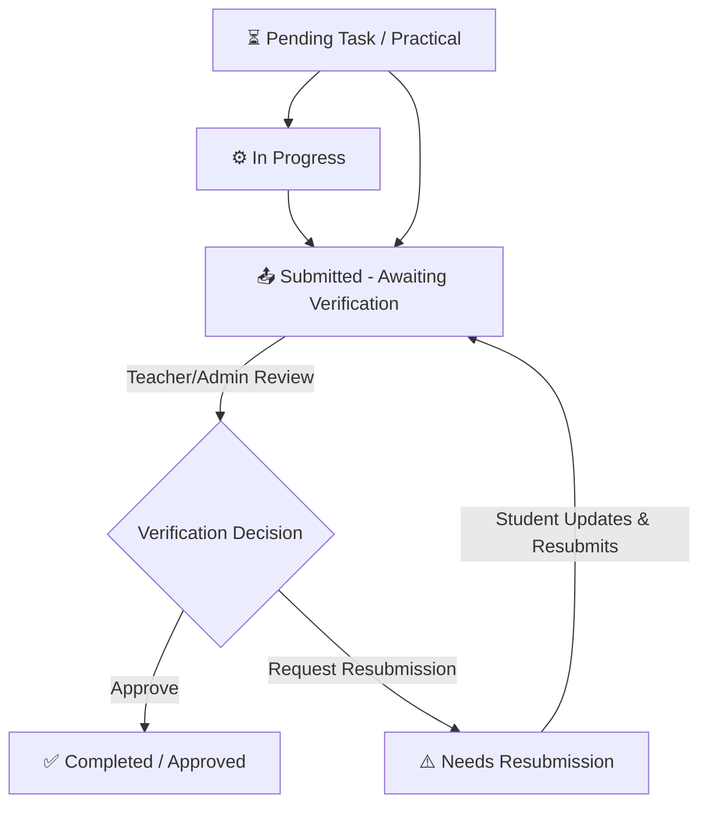

# 🎓 College Assignment & Practical Submission Tracker (v4.0)

A desktop application designed for colleges, teachers, and students to manage academic assignments, practicals, journals, projects, and presentations.

Built using **Python 3**, **Tkinter (Modern Desktop GUI)**, **SQLite**, and **Matplotlib**.

---

## 📸 Application & Analytics Preview

| Task Status Distribution | Subject Workload Breakdown |
| :---: | :---: |
|  |  |

| Subject Completion Progress (%) |
| :---: |
|  |

---

## 🔄 Role-Based Verification & Completion Workflow



- **Student Role**:
  - Adds assignments, practicals, journals, and presentations.
  - Submits tasks for verification (`📤 Submit for Verification`).
  - Cannot directly mark tasks as Completed (requires teacher review).
  - Can resubmit if a teacher requests changes (`⚠️ Needs Resubmission`).
- **Administrator / Teacher Role**:
  - Reviews student submissions.
  - Approves submissions (`✓ Approve / Complete`).
  - Requests resubmission (`↻ Request Resubmission`).
  - Manages student accounts (100 pre-seeded students) and academic subjects.

---

## 🚀 How to Run on Any Computer

This is a **native desktop application** (built with Tkinter). It runs locally on your PC.

### Option 1: Quick 1-Click Launch (Windows)
1. Download or clone this repository:
   ```bash
   git clone https://github.com/shubhamdadas2007/College-Assignment-Tracker.git
   ```
2. Double-click **`run.bat`**. It will install required dependencies and launch the GUI window!

### Option 2: Run via Terminal / Command Prompt
1. Install dependencies:
   ```bash
   pip install -r requirements.txt
   ```
2. Start the application:
   ```bash
   python main.py
   ```

---

## 🔑 Login Credentials

| Role | Username / Email | Password | Allowed Capabilities |
| :--- | :--- | :--- | :--- |
| **Administrator / Teacher** | `admin` / `admin@college.edu` | `admin123` | Review Submissions, Approve / Reject, Manage Students & Subjects |
| **Student (Rahul)** | `rahul` / `rahul.sharma@college.edu` | `student123` | Submit for Verification, Track Deadlines, Personal Analytics |
| **Student (Priya)** | `priya` / `priya.patel@college.edu` | `student123` | Submit for Verification, Track Deadlines, Personal Analytics |
| **Students 1-100** | *e.g.* `aman.verma`, `sneha.joshi` | `student123` | Individual Student Portal Access |

---

## 🧪 Run Automated Tests
```bash
python test_app.py -v
```
All 13 unit and integration tests verify authentication, dynamic deadline states, role permissions, and metrics calculation.
